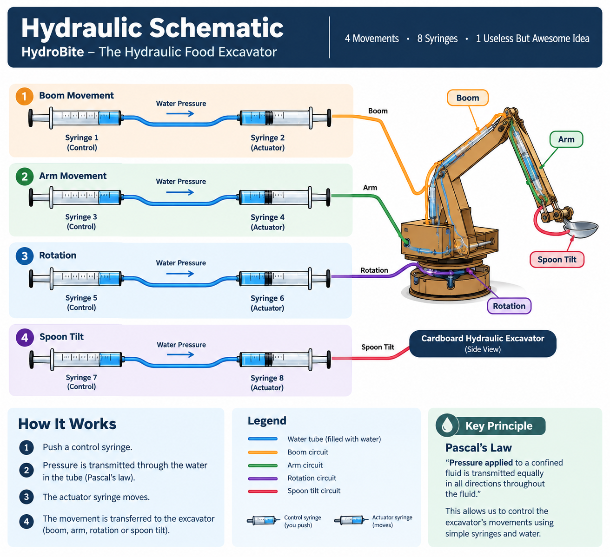
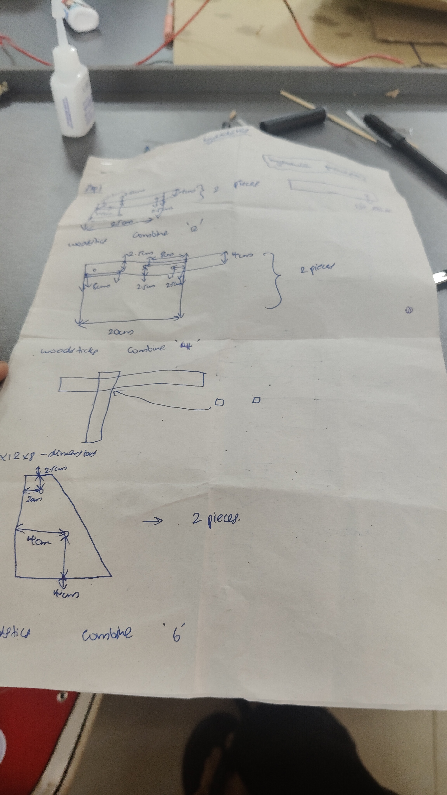
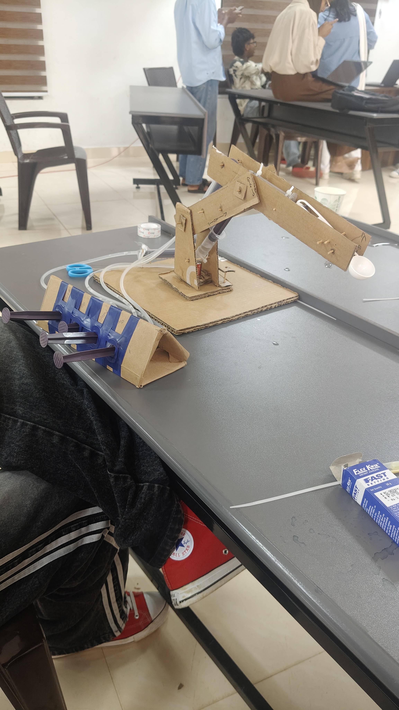

HYDROBITES

## Basic Details
### Team Name: CLAN

### Team Members
- Team Lead: Muhammed Aman abdul latheef - Al azhar college of engineering and technology 
- Member 2: Anfal Anzari - Al azhar college of engineering and technology 

### Project Description
HydroBite is a low-cost cardboard hydraulic excavator that replaces its bucket with a spoon to scoop and deliver food. It uses syringes, water, and Pascal’s law to control the excavator's movements.
### The Problem (that doesn't exist)
humans wasting time by washing hands before or after eating food

### The Solution (that nobody asked for
By replacing a simple spoon with a hydraulic JCB that scoops, lifts, rotates, and delivers the food—because apparently, a spoon was too efficient. 
## Technical Details
### Technologies/Components Used
For Software:
- [Languages used]
- [Frameworks used]
- [Libraries used]
- [Tools used]

For Hardware:
Main Components
Cardboard body, boom & arm
8 syringes
Silicone tubes
Plastic spoon
Water
Tape
wood stick 
Specifications
Low-cost hydraulic mechanism
Water-powered
Manual syringe control
Cardboard construction
4 movements: boom, arm, rotation & spoon tilt
Tools Required
Scissors
Cutter
glue
Ruler
Pencil/marker

### Implementation
For Software:
# Installation
[commands]

# Run
[commands]

### Project Documentation
For Software:

# Screenshots (Add at least 3)

*Add caption explaining what this shows*

*Add caption explaining what this shows*

*Add caption explaining what this shows*

# Diagrams

*Add caption explaining your workflow*

For Hardware:

# Schematic & Circuit

*Add caption explaining connections*

*Add caption explaining the schematic*

# Build Photos

  
  

*Explain the build steps*

  
  

*Explain the final build*

### Project Demo
# Video
https://drive.google.com/file/d/1FfWNdErYFT2YB6eM4XGY2AE3JPw4j9CE/view?usp=drivesdk
*Explain what the video demonstrates*

# Additional Demos
[Add any extra demo materials/links]

## Team Contributions
- [Name 1]: [Specific contributions]
- [Name 2]: [Specific contributions]
- [Name 3]: [Specific contributions]

---
Made with ❤️ at TinkerHub Useless Projects 

